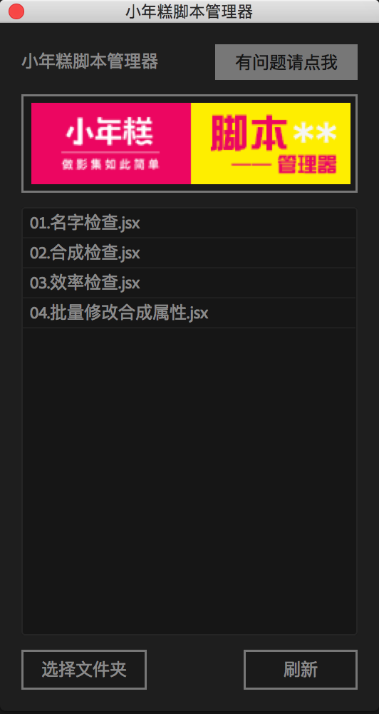
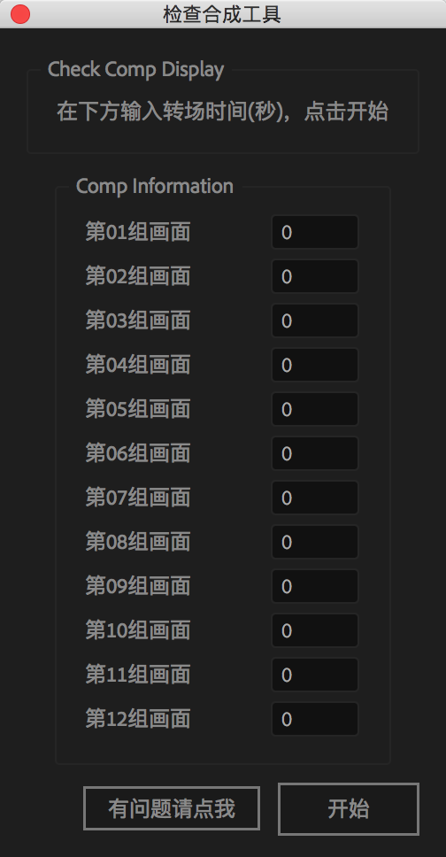
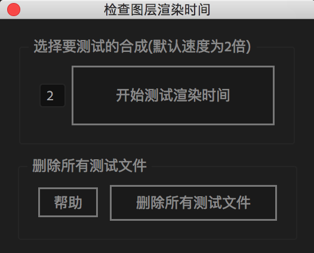

欢迎使用小年糕设计师工具
=====================
本脚本主要适用/开发于**After Effect cc 2014**，不保证其他版本也能正常使用。
  
>安装方法
=====================

>>windows
---------------------
>>>下载**Windows.exe**并双击安装，安装目录可以随意。 
>>>安装完成后，在AE软件中选择**file**-**script**-**open script**，找到安装目录，打开安装目录下的**小年糕设计师工具.jsx**，即可看到脚本管理器界面。 
>>>*第一次使用时，会提示选择脚本目录，找到安装目录下的script文件夹，点击确定即可。* 

>>Mac OS
---------------------
>>>下载**Mac_OS**文件夹，并复制到电脑任意位置。 
>>>复制完成后，在AE软件中选择**file**-**script**-**open script**，找到安装目录，打开目录下的**小年糕设计师工具.jsx**，即可看到脚本管理器界面。 
>>>*第一次使用时，会提示选择脚本目录，找到安装目录下的script文件夹，点击确定即可。* 

>使用方法
=====================
>>**小年糕设计师工具.jsx** 
---------------------
>>>打开**小年糕设计师工具.jsx**以后，可以看到界面窗口: 

<b>选择文件夹</b>是选择脚本所在目录 刷新是指更新文件夹内的脚本文件 
<i>本脚本汉化于 Jeffrey R. Almasol 的 rd_ScriptLauncher.jsx，感谢原作者！</i>
  

>>**01.名字检查.jsx** 
---------------------
>>>双击**01.名字检查.jsx**脚本以后，程序会自动判断 
>>>>1.AE工程中的所有文件命名，是否含有空格等特殊字符。 
2.AE工程的颜色深度是否为8dp，如果不是会自动改为8。 
3.脚本将过滤Solid图层。 
4.需要过滤的字符可以在/include/Main.jsx内添加。 
 

>>**02.合成检查.jsx** 
---------------------
>>>打开**02.合成检查.jsx**以后，可以看到界面窗口: 

<b>Comp Information</b> 内可以输入每组合成的转场时间，时间单位为s，没有可以不用添加。 
点击<b>开始</b>按钮以后，程序将自动搜索AE工程所有start/end/body_photo/body_video合成，并创建4个新合成，供设计师查看每组/每个合成效果是否有问题 
交叠方式为正序交叠、合成排列方式为顺序排列 

  

>>**03.效率检查.jsx** 
---------------------
>>>打开**03.效率检查.jsx**以后，可以看到界面窗口: 

本脚本为测试选中合成的每个图层渲染效率 
原理为遍历选中的合成中所有图层，关闭其中一个图层，添加到渲染队列(遇到同名图层的时候跳过)、直到将所有图层添加到队列后开始渲染。 
渲染完成后会提示去除每个图层后的渲染时间、 
以供设计师找出占资源最多的图层，看是否可以优化。  
<b>左边的小输入框</b> 内可以输入渲染时跳过不渲染的帧数、跳帧数默认为2，可以根据渲染速度自行更改。  
点击<b>开始</b>按钮以后，程序将自动执行以上功能(缓存文件位于用户桌面，可以查看去除某一合成后的效果，暂时只支持windows，暂未对MacOS平台做适配) 
点击<b>删除</b>按钮以后，程序将自动删除以上用到的所有文件(本脚本将删除所有缓存文件，包括ae缓存，渲染文件) 

  